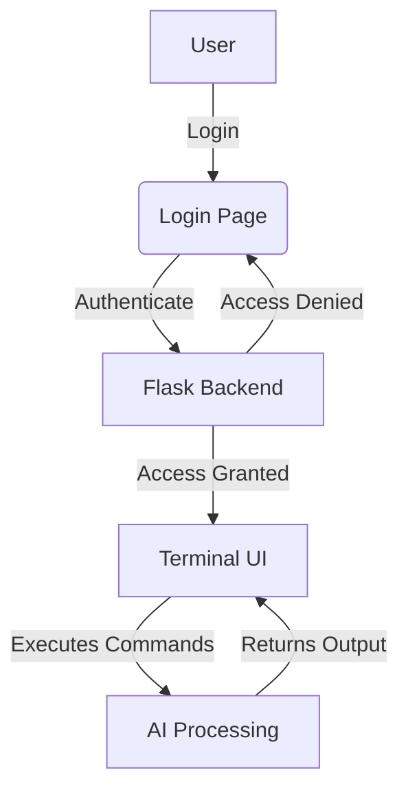

# 🚀 AI-Enhanced Terminal

  

> A secure and responsive AI-powered terminal interface built with Flask, TailwindCSS, and Python.

## 📌 Features

✅ **Secure Login System** 🔐  
✅ **AI-Powered Commands Execution** 🤖  
✅ **Dark Mode Support** 🌙  
✅ **Real-Time Processing** ⚡  
✅ **User-Friendly UI** 🎨  

---

## 🎨 UI Preview



---

## 🔧 Installation & Setup

### 1️⃣ Clone the Repository
```bash
git clone https://github.com/Awrsha/Terminal-with-AI-Analysis.git
cd Terminal-with-AI-Analysis
```

### 2️⃣ Install Dependencies
```bash
pip install -r requirements.txt
```

### 3️⃣ Run the Application
```bash
python app.py
```

The server will start at `http://127.0.0.1:5000/`

---

## 🛠️ Technologies Used

| Technology | Description |
|------------|-------------|
| Python 🐍  | Backend Processing |
| Flask 🌐   | Web Framework |
| TailwindCSS 🎨 | UI Styling |
| JavaScript 📝 | Frontend Logic |

---

## 🚀 Future Enhancements

- 🔄 **OAuth Authentication**
- 🎤 **Voice-Controlled Commands**
- 📊 **Analytics Dashboard**

---

## 🤝 Contributing

1. Fork the project
2. Create a new branch (`feature-xyz`)
3. Commit your changes
4. Push to the branch
5. Open a Pull Request

---

## 📜 License

📝 Appache License. See `LICENSE` file for details.

---

💻 **Developed with ❤️ by Amir Mohammad Parvizi**
